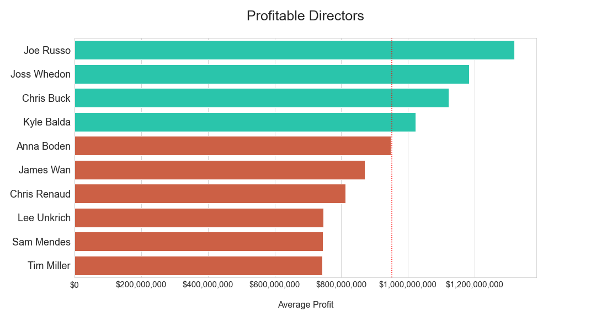
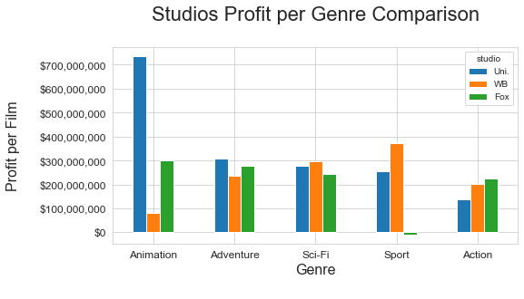

# Microsoft Movie Industry Entrance Plan

**Author**: David Cruz, Tom Smith

## Overview

This project takes on the movie scene to give Microsoft insightful recomendations for their first steps into the movie landscape. We recieved our data from databases such as iMDB, The Numbers, and Box Office Mojo. Our results show genres, studios, and directors Microsoft should focus on creating partnerships with. Microsoft can use our insights to create a plan to be successful in the movie industry.

## Business Problem

Microsoft wants to take a dive into the movie industry. Being Microsoft, their forte is technology but not so much movie making. We were put on this project to help them get their start in the movie landscape. By looking at movie databases, we will be able to give them suggestions and help them decide what movies to make. As a business, they would focus on profits. For their consumers, they should focus on popularity. By using profit and popularity as a metric, Microsoft will know what genres, directors, and studios to work with.

## Data

We used various established movie databases. [The Numbers](https://www.the-numbers.com/about) provided geat information regarding worldwide gross, which was used to get our profitable data sets. This database had over 5.7k movies to work with. [Box Office Mojo](https://help.imdb.com/article/imdbpro/industry-research/box-office-mojo-by-imdbpro-faq/GCWTV4MQKGWRAUAP?ref_=mojo_ftr_help#) provided data on monetary values and studios for movie titles. We used this database (3.3k entries) to get the movie studios for each movie title. The [iMDB](https://help.imdb.com/article/imdb/general-information/what-is-imdb/G836CY29Z4SGNMK5?ref_=__seemr#) database was used in our popular data sets. iMDB provied much information on vote counts, directors, and genres (86k titles). By combining and cleaning data with all three databases, we were able to gather data on popular/profitable studios, genres, and directors.

## Methods

In this project, we decided popularity can be decided by number of votes per title, and profits can be calculated by worlwide gross minus production cost. We had to clean our data and eliminate duplicate information. We also had to merge our data sets to gather the info we wanted to compare. By using profit and popularity as metrics, we were able to see the top genres, studios, and directors in each metric. We were then able to dive deeper into our recommended studios and look at their strongest genre. 

## Results

Looking at genre first, we found the top 10 by popularity and profit. We also pointed out the genre that were above average in profit and popularity. We found the genres adventure, sci-fi, action, and fantasy in both graphs. 

*Top Popular Genre*

We then explored the directors side of things. We found Tim Miller, Joss Whedon, and Joe Russo to share top 10 in profits and popularity.

*Top Profitable Directors*

Looking on the studio side of things, Paramount, Warner Bros., Universal, and Fox had good potential for high popularity and profit. We decided to take it a step further and see each individual studio vs the  genres they are best at. 

*Top Studios by Genre*

## Conclusions

These are our final recomendations for Microsoft:
- Studios to work/aquire
    - Warner Bros
    - Fox
    - Universal
- Genres to focus on
    - Adventure
    - Sci-Fi
    - Action
- Directors to hire
    - Tim Miller
    - Joss Whedon
    - Joe Russo

## For the Future

These are a couple of routes Microsoft can take to further expand their movies across their platforms.
- Microsoft owns Xbox with over 100 million of users. Tapping into that could boost their movies.
- Once having a foothold in the industry, they can push their morals and goals as a company through their movies.
    - This can be their fight for equality, reaching a worldwide audience, humanitarian projects, and more.

## For More Information

Contact: [David Cruz](mailto:dcruzven20@gmail.com)

Contact: [Tom Smith](mailto:itombsmith@gmail.com)

